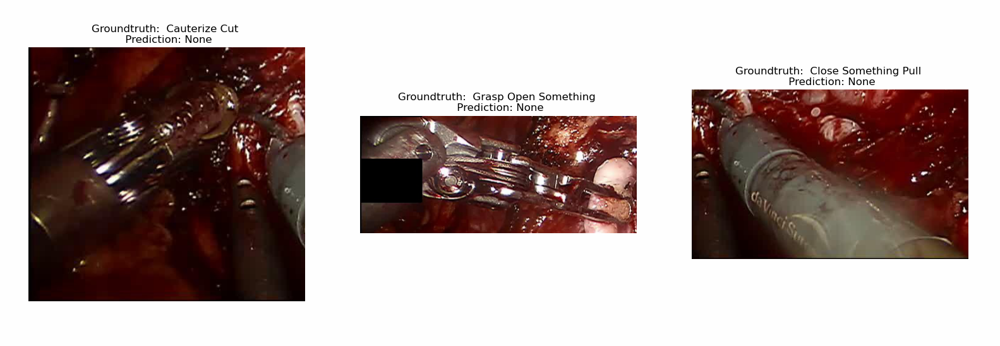

# Baseline
In this Baseline, we approached the atomic action recognition problem by implementing [[Symmetric Dilated Convolution for Surgical Gesture Recognition](https://arxiv.org/pdf/2007.06373.pdf)]

## Dataset

For the data that we used in our baseline, it is necessary to create a soft link for both the images and their annotations. Run the following lines:

    ln -s /media/bcv007/SSD6/MICCAI2021/data/SantaFeDataset/modified_keyframes data
    ln -s /media/bcv007/SSD6/MICCAI2021/data/SantaFeDataset/annotations/basic_anns_faster_features/online_dataset annotations
    
[dataset.py](dataset.py) will allow you to load both train and test data sets. 
    
## Train

In [train.py](train.py), you will find the SdConv (Symmetric Dilated Convolution) implementation for training it. Additionally, you can find the argparse, which contains the arguments. 

## Test

To evaluate the performance of the model, in [test.py](test.py) there is the mAP (mean Average Precision) metric function. You can run this file for obtatining mAP and test accuracy of your model. 

## Visualization

  

The image above shows the result that we obtained by implementing SdConv. To visualize your results, you just have to run [visualization.py](visualization.py) file. That file will take a random image of the dataset, and according to a trained model, it will plot to you the ground truth and the prediction for each bounding box found in the random image. 
