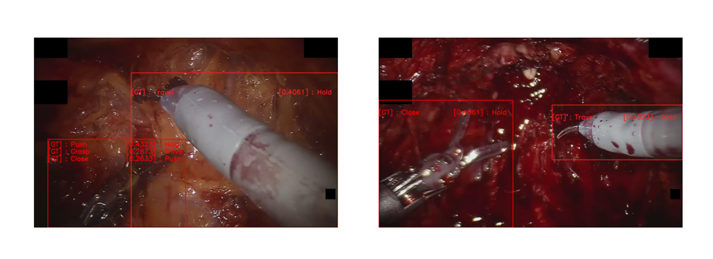

# Atomic Action Recognition for Surgical Scene Understanding by using Transformers

In this repository, you will find an approximation to the atomic surgery actions recognition problem. By implementing PSI-AVA, a dataset created by the Biomedical Computer Vision (BCV) research group from Universidad de los Andes, we trained a model with [Multiscale Vision Transformers](https://arxiv.org/abs/2104.11227.pdf) architecture.



## Baseline

To approach the problem mentioned above, we proposed a baseline according to [Symmetric Dilated Convolution for Surgical Gesture Recognition](https://arxiv.org/pdf/2007.06373.pdf) (SdConv). This algorithm takes as inputs Temporal-Spatial Features resulting from a combination of CNN-TCN models. SdConv was proposed to the JIGSAWS dataset, which provides annotations of 15 surgical gestures that correspond to activity segments. Thus, we modified SdConv to PSI-AVA dataset. This dataset differs from JIGSAWS because PSI-AVA has assigned from one to three actions per instrument, and one frame can have more than one instrument. We also proposed other Temporal-Spatial Features derived from a CNN-LSTM combination, since literature reports that LSTM has a good performance for this task too.

The metrics that we obtained can be seen as follows:

| Metrics | PSI-AVA (TCN) | PSI-AVA (LSTM) | JIGSAWS (TCN) | JIGSAWS (LSTM) |
| :-------------: | :-------------: | :-------------: | :-------------: | :-------------: | 
| **Acc** | 0.1841 | X | 0.6593 | 0.6591 |
| **F-Score** | 0.4081 | X | 0.6593 | 0.6591 |

In this repository, there is the option of running test with the model for each of the dataset and the CNN-TCN or CNN-LSTM implementation. By the following soft link, there will be all the models available:

```
    ln -s ...
```

## Final Method

### Preparation

To implement our final method, you must verify some libraries versions and run the following lines first:
- Pytorch = 1.10
- CUDA = 10.2
```
conda create -n mvit anaconda python=3.8
    
conda activate mvit
    
conda install pytorch torchvision torchaudio cudatoolkit=10.2 -c pytorch
    
python -m pip install detectron2 -f \
  https://dl.fbaipublicfiles.com/detectron2/wheels/cu102/torch1.10/index.html
```
- simplejson: `pip install simplejson`
- PyAV: `conda install av -c conda-forge`
- skelearn: `pip install sklearn`
- OpenCV: `pip install opencv-python`
- FairScale: `pip install 'git+https://github.com/facebookresearch/fairscale'`

## Credits

Our algorithms were based on:

https://github.com/lulucelia/SdConv

https://github.com/facebookresearch/SlowFast/blob/main/projects/mvit


